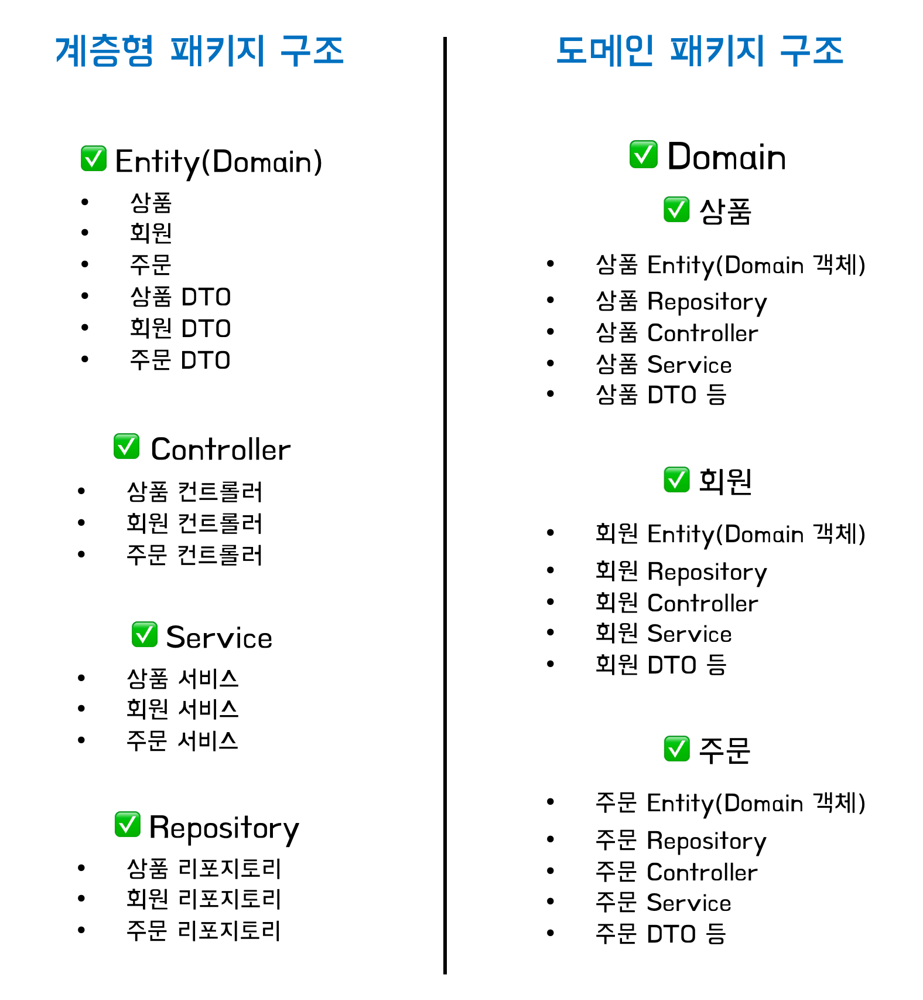
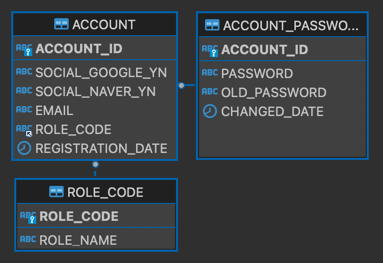
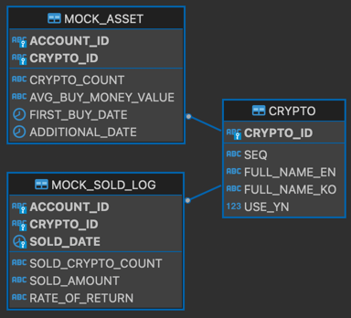
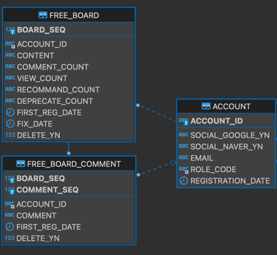
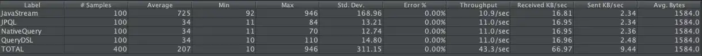

# 모의 가상화폐 투자 사이트
###### 토이프로젝트

[//]: # (#### 개발환경)
[//]: # ( - Springboot 2.7.7 &#40;Gradle&#41;)
[//]: # ( - 디펜던시 : Security, lombok, thymeleaf ... &#40;OAuth2 는 추가예정&#41;)
[//]: # ( - JPA &#40;MySQL&#41;)
[//]: # ( - Tools : IntelliJ, DBeaver, Docker&#40;MySQL&#41;, Git)

*****

## 개요
**가상화폐 거래소의 시세 조회 API를 활용해 모의투자 사이트를 구현한다.**  
**구매시점의 가격을 조회하고 회원별로 구매금액과 수량을 데이터베이스에 저장한다.**  
**저장된 데이터 기반으로 모의투자통계를 계산하고 보여준다.**

<br>


[//]: # (**Springboot 기반으로 요구사항정의 이후 도메인설계, 로직처리 ... **  )
[//]: # (**서비스확장과 TDD로 진행. -> Junit에 정리필요**)
[//]: # (테스트 케이스를 작성하고 최소한의 코드구현 -> 요구사항에 맞는 로직으로 리팩토링)
[//]: # (최대한 스프링 개념을 활용해서 구현해보기)

*****
## 프로젝트 구조 (Architecture)

###### ex)

### 1. 계층형
- 장점
  1. 다른 계층간 결합도를 많이 낮춰서 기존 서비스의 수정이나 대체가 쉬움
  2. 계층간 구조를 잘 나누면 재사용성을 높일 수 있음  

- 단점 
  1. 구조를 안정적으로 가지는 만큼 계층의 클래스들이 많이 모여 가독성이 떨어짐
  2. 쉬운만큼 계층을 건너뛰는 안좋은 코드들이 쌓여서 테스트와수정/대체가 힘들어짐
  3. 설계시 계층의 규모파악과 분리가 모호하다면 수정이 빈번해질 수 있음
  4. 데이터베이스 주도 프로젝트가 되기가 쉬움

###### ex)
- Global
  - Exception
  - Validation
  - ...
- Repository (Dao)
    - Entity
    - Interface
    - Configuration
- Service (Domain)
    - User
    - Admin
    - ....
- Controller
- ....

### 2. 도메인형
###### [참고](https://techblog.woowahan.com/2637/)
- 장점 
  1. 관련 코드가 모여있어서 가독성이 좋음
  2. 서비스 확장과 테스트가 쉬움

- 단점
  1. 프로젝트 전체 구조의 파악이 어려움
  2. 도메인의 공통된 기능은 모듈화가 필요하지만 모듈화에만 의존할 수 있음
  3. 도메인별로 동일한 메커니즘을 갖지 못할수가 있어 생산성의 저하의 여지가 큼
  4. 코드가 반복되기 쉬움

###### ex)
- Common
  - Market
    - API
    - Access
    - ...
  - Configuration
    - Security
    - ...
  - Request
  - ...
- Admin
  - Login 
  - Purchase
  - ...
- User
  - Login (반복됨)
  - MyPage
  - ...
- FreeBoard
  - ...
*****

## 데이터베이스 (MySQL : InnoDB)
- TODO
  - 사용자들 끼리 메세지를 주고받을 수 있는 기능 고려 (테이블 추가 생성필요)
  - DataType 재정의 필요 
  - 코멘트 작업 필요 
  - 추후 BTC마켓, 다른 거래소 API를 활용하기 위해 확장성을 고려한 정규화 및 수정 필요

### 1. **회원테이블**  

<br><br>
### 2. **매입테이블**  

<br><br>
### 3. **게시판테이블**  

<br><br>
*****


## 기본데이터 초기화 (API 활용)
### 1. [Upbit API](https://api.upbit.com/v1/market/all)를 활용하여 DB의 CRYPTO테이블의 초기값을 설정할 수 있어야한다.
###### 별도의 동작이 없을 경우 최초로 한번만 실행된다. (추후 변경예정)

- 현재 한화만 기준으로 하기 때문에 market 정보의 한화마켓(KRW)인 정보만 저장한다.  
뒤 암호화폐의 약어는 `CRYPTO`테이블의 `CRYPTO_ID`에 저장된다.
```
ex)
0 :
   { market 	  :	KRW-BTC
     korean_name  :	비트코인
     english_name :	Bitcoin },
1 : 
   { market       :	KRW-ETH
     korean_name  :	이더리움
     english_name :	Ethereum },
....
```

###### ~~2. CRYPTO테이블의 정보로 각각의 암호화폐의 대한 거래정보를 불러오고 DB에 저장한다. [(예시)](https://api.upbit.com/v1/ticker?markets=KRW-BTC)~~

### 2. 회원가입과 로그인 및 회원정보 관리
1. Springboot Security를 활용해서 기본적인 회원가입과 로그인구현 
   - DB에 패스워드는 항상 암호화 (_BcryptPasswordEncoder_)  


2. 비밀변호 변경 시 예전 패스워드로 바꾸지 못하게 설정 
   - PASSWORD 테이블의 과거 패스워드 이력 컬럼 또는 테이블 추가 필요
   - 변경 후 비밀번호가 변경 전 비밀번호가 유사하다면 변경 불가


###### 3. ~~OAuth2를 활용한 소셜로그인 구현 (ACCOUNT 테이블 수정 필요)~~


### 3. 모의투자가 가능한 목록 조회
1. ###### ~~사이트 관리자는 CRYPTO테이블의 USE_YN의 값을 설정할 수 있다.~~   


2. 암호화폐 조회요청이 들어오면 `CRYPTO`테이블의 정보를 활용하여  
   각각의 가격과 정보를 JSON 타입으로 리턴한다.   


3. 너무 많은 API 요청을 막기 위해 1분의 요청 대기시간을 둔다. 
   - 1분내로 다시 요청이 들어오면 static한 이전 정보를 리턴한다. 

*****

## 사용자
### 1. 매입
- 사용자가 모의투자시 거래소 API로 가격을 불러오고 `MOCK_ASSET` 테이블의 해당정보를 저장한다.
   - `AVG_BUY_MONEY_VALUE` 컬럼은 구매시 마다 자동으로 갱신되어야 한다.

### 2. 매도
- 매도시 `MOCK_ASSET` 테이블에서 정보를 삭제하기 전에 `MOCK_SOLD_LOG` 테이블로 삭제할 데이터를 저장한다.
   - `RATE_OF_RETURN` 컬럼은 삭제요청이 들어오는 순간 해당 암호화폐의   
   현재가를 조회하여 수익률을 계산하고 저장한다.
   - ~~현재시간을 PK로 같이 저장하여(`SOLD_DATE`) 통계화 할 수 있도록한다.~~

### 3. 통계
1. `MOCK_SOLD_LOG` 테이블로 통계를 낸다.
   - 전체, 코인별, 날짜별로 수익률, 금액 등
   - [ ] TODO : (통계정보 관리 필요) ~~DB의 View, 요청시 마다 자바로 계산, 테이블로 관리 정해야함~~  
     - [ ] DB View, 테이블 : 사용자가 매입 시 트리거 작성 필요  
     (Data Access Layer 아니면 DB에서)
     - [ ] 요청시 마다 파싱 : JPA를 사용하기 때문에 Entity 또는 Repo(JPQL)로 처리  
     (조회시간 계산 필요)  
     ex)



2. 통계서비스에서 사용자는 자신의 `MOCK_SOLD_LOG` 테이블의 정보를 모두 삭제할 수 있다. (초기화)

*****

## 관리자

### 1. 사이트 관리 (서비스관련 : 코인목록 편집 등), 
1. 모의투자가 가능한 코인목록을 설정하거나 API를 활용해서 초기화

### 2. 회원관리 
1. 회원의 권한을 변경하거나 이메일 등을 조회할 수 있다.
2. ~~회원 대상으로 이메일을 보낼수 있다.~~ 

### 3. 자유게시판 (공지사항 등)
1. 자유게시판에서 사용자가 작성한 글/댓글을 삭제할 수 있다.
2. 공지사항을 작성/삭제할 수 있다.

### 4. 관리자페이지 요청 시 검증 과정 필요 (Security)
1. Security 설정과정에서 제어 ex) antMatchers("/admin").hasRole(UserRole.ADMIN.toString())


<br><br><br><br><br><br><br><br><br><br><br><br><br><br><br><br>

[//]: # (## ~~테스트~~)

[//]: # (1. ~~비밀번호 변경 시 이전에 사용했던 비밀번호면 예외~~)

[//]: # (2. ~~초기데이터의~~ )


